# DemoCaricature (CVPR'24)

[](https://democaricature.github.io)
[](https://arxiv.org/abs/2312.04364)
[](https://badges.toozhao.com/stats/01HH2FQN0E8N63YV8DD088Q4KP "Get your own page views count badge on badges.toozhao.com")

Official PyTorch Implementation of "DemoCaricature: Democratising Caricature Generation with a Rough Sketch."


**Abstract**: In this paper, we democratise caricature generation, empowering individuals to effortlessly craft personalised caricatures with just a photo and a conceptual sketch. Our objective is to strike a delicate balance between abstraction and identity, while preserving the creativity and subjectivity inherent in a sketch. To achieve this, we present Explicit Rank-1 Model Editing alongside single-image personalisation, selectively applying nuanced edits to cross-attention layers for a seamless merge of identity and style. Additionally, we propose Random Mask Reconstruction to enhance robustness, directing the model to focus on distinctive identity and style features. Crucially, our aim is not to replace artists but to eliminate accessibility barriers, allowing enthusiasts to engage in the artistry.

### ⏳ Coming Soon
- [ ] Training scripts

### Environment
`pip install -r requirements.txt`

### Weights
Check pretrained identities in `./identities`! 

### Local Gradio Demo
`python gradio_app.py`

### Diffusers Implementation
```python
import torch
from diffusers import T2IAdapter, EulerDiscreteScheduler
from PIL import Image, ImageOps

from handler import ExplicitROMEHandler
from pipeline import TextualStableDiffusionAdapterWithTauPipeline

model_name = "runwayml/stable-diffusion-v1-5"
adapter_name = "TencentARC/t2iadapter_sketch_sd15v2"

adapter = T2IAdapter.from_pretrained(adapter_name, torch_dtype=torch.bfloat16)
scheduler = EulerDiscreteScheduler.from_pretrained(model_name, subfolder="scheduler")
pipe = TextualStableDiffusionAdapterWithTauPipeline.from_pretrained(
    model_name,
    adapter=adapter,
    scheduler=scheduler,
    dtype=torch.bfloat16,
    variant="fp16",
).to("cuda")
pipe.safety_checker = None
handler = ExplicitROMEHandler(pipe)
handler.load_explicit_rome("identities/Barack_Obama", token="<ID>")

sketch = Image.open("assets/sketches/Barack_Obama.jpg").convert("L")
sketch = ImageOps.invert(sketch)

generator = torch.Generator("cuda").manual_seed(100)
sample = handler(
    prompt="a caricature of <ID>",
    image=sketch,
    num_inference_steps=20,
    guidance_scale=9,
    rome_scale=1.1,
    adapter_conditioning_scale=0.8,
    adapter_conditioning_tau=0.65,
    generator=generator,
).images[0]
sample.save("Barack_Obama_caricature.jpg")
```
<p float="left">
    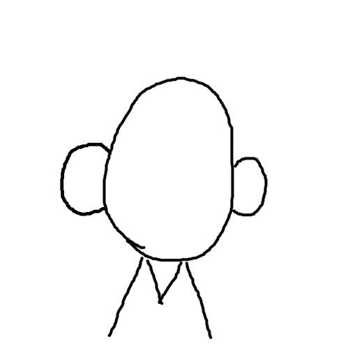
    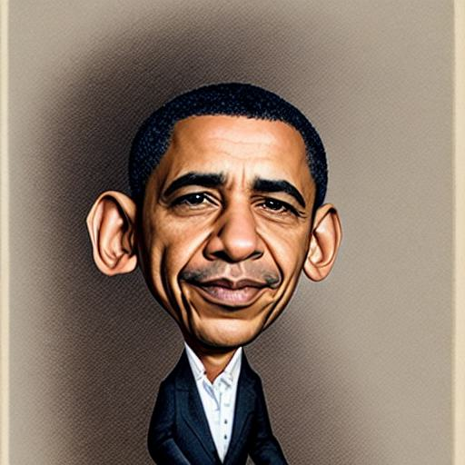
</p>

---

## Summer Research Project 2026: Inference Analysis
**Researcher:** Ayhan Meherrem (s336322, Politecnico di Torino)
**Context:** Independent evaluation of image quality, controllability features, and identity-shape trade-offs in multimodal diffusion models.

The following grid demonstrates the effect of `rome_scale` (identity preservation) and `shape_scale` (structural deformation control) on the final generated caricature.

| Rome Scale \ Shape Scale | Shape 0.5 | Shape 0.8 | Shape 1.0 |
| :--- | :---: | :---: | :---: |
| **Rome 0.8** | 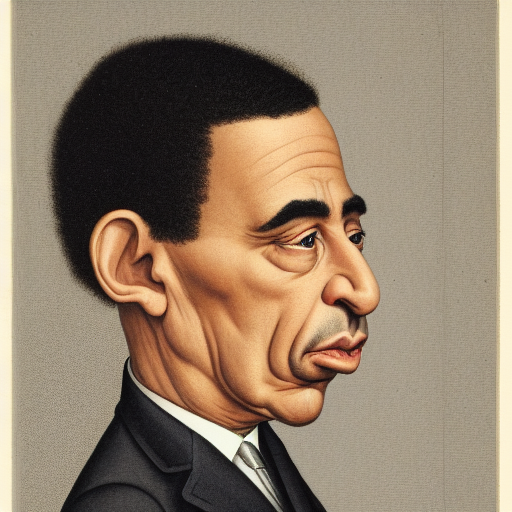 | 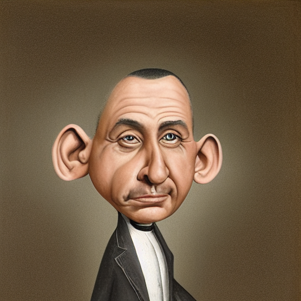 | 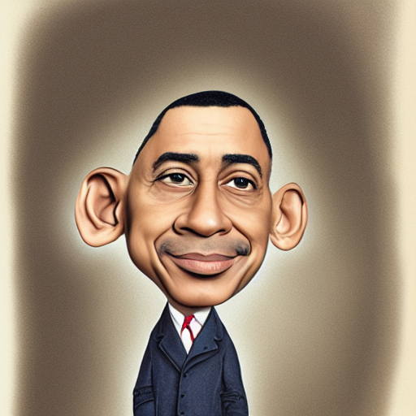 |
| **Rome 1.0** | 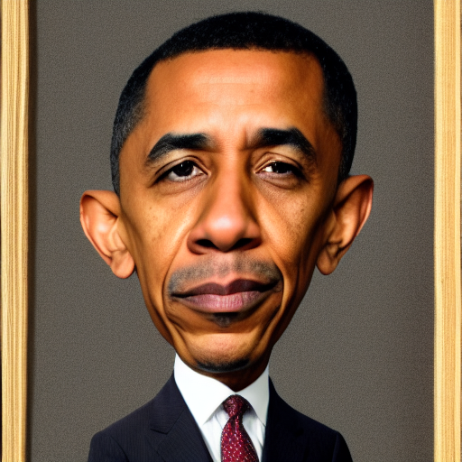 | 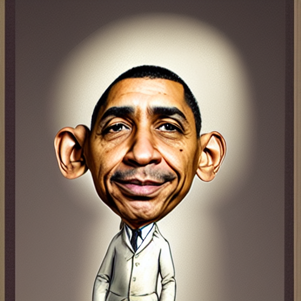 | 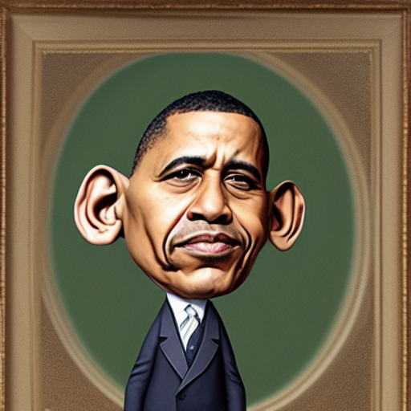 |
| **Rome 1.2** | 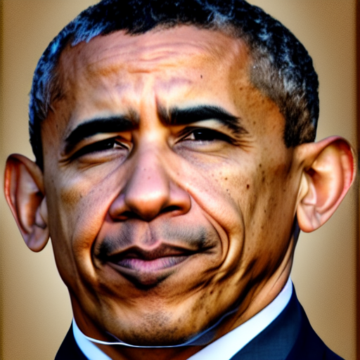 | 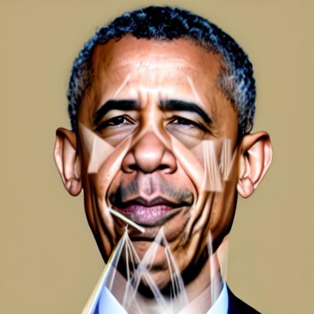 | 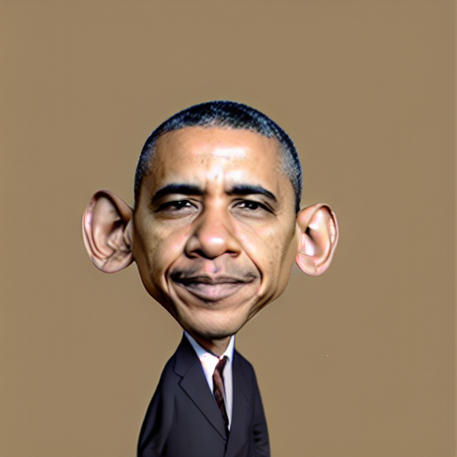 |

### Analysis of the Identity-Shape Trade-off

The generated grid demonstrates the practical limitations and structural artifacts present in the identity-shape trade-off during sketch-guided diffusion:

* **Identity Failure (Rome 0.8):** At lower `rome_scale` values (0.8), the Explicit ROME Handler fails to inject sufficient identity features into the cross-attention layers. The output completely loses the likeness of the target identity, rendering the generated caricature unrecognizable regardless of the applied `shape_scale`.
* **Conditioning Conflict and Artifacts (Rome 1.2, Shape 0.8):** Combining a high identity weight (`rome_scale=1.2`) with strong spatial conditioning (`shape_scale=0.8`) causes severe visual artifacts. The network fails to reconcile the dominant identity embeddings with the structural constraints of the T2I-Adapter. This mathematical conflict results in explicit conditioning vectors being rendered directly as unblended geometric lines across the facial structure.
* **Operational Window:** The model exhibits a narrow effective operational window. Pushing either the identity preservation or the structural deformation to their extremes results in systemic generation failure, highlighting the instability of the current explicitly injected cross-attention mechanism under strong geometric constraints.
